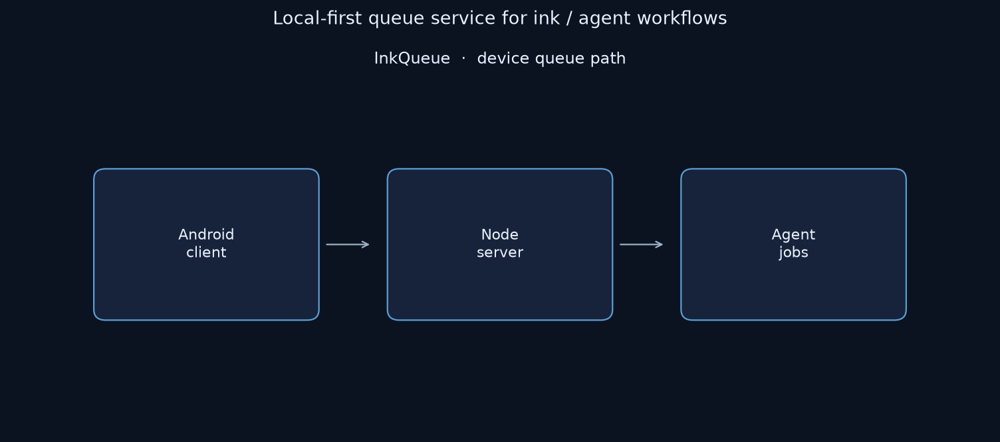

# InkQueue

**Local-first queue service stack: Node server plus Android client experiments.**

[English](README.md) | [中文](README.zh-CN.md)

[](https://github.com/Phoenix0531-sudo/InkQueue/actions/workflows/ci.yml)
[](LICENSE)

Agent / device workflow plumbing.

## Preview



## Features

- server/ Node service
- android/ client experiments
- npm test CI for the server path
- scripts/ + tasks helpers

## Get started

### Install

```bash
git clone https://github.com/Phoenix0531-sudo/InkQueue.git
cd InkQueue/server
npm install && npm test
```

### Usage

See server/ README and scripts for start commands. Keep tokens out of git.

## Project layout

```
server/  android/  scripts/  tasks/
```

## Notes

Internal tooling portfolio piece. Ports are environment-specific.

## License

MIT. Free for commercial use with attribution where applicable. See [LICENSE](LICENSE).
