# InkQueue

<p align="center">
  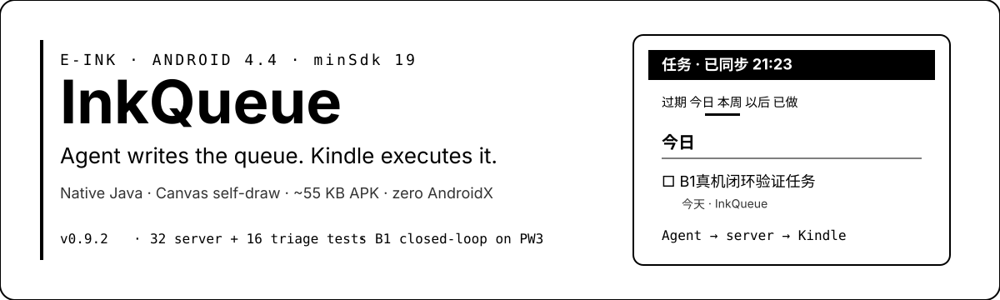
</p>

<p align="center">
  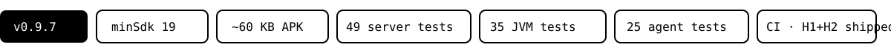
</p>

**Agent-synced task queue for e-ink devices.**

Agent writes the queue in conversation. Kindle only views, completes, and postpones — a quiet terminal for Paperwhite 3, not a Material todo app.

| | |
|---|---|
| **Device** | Kindle Paperwhite 3 · Android 4.4.2 · KOSP/CracKDroid · 6″ e-ink · ~512 MB |
| **Client** | Native Java · Canvas self-draw · minSdk 19 · zero AndroidX · ~55 KB APK |
| **Server** | Node reference API on port `8787` · JSON file store · optional TLS |
| **Agent path** | `node agent/inkq.js` + [`agent/interface.md`](agent/interface.md) · MCP optional |
| **Status** | **v0.9.5** · 41 server + 35 Android JVM + 25 agent tests · B1 closed-loop verified on real PW3 |

Home-screen name on device: **任务**.

---

<p align="center">
  
</p>

<p align="center">
  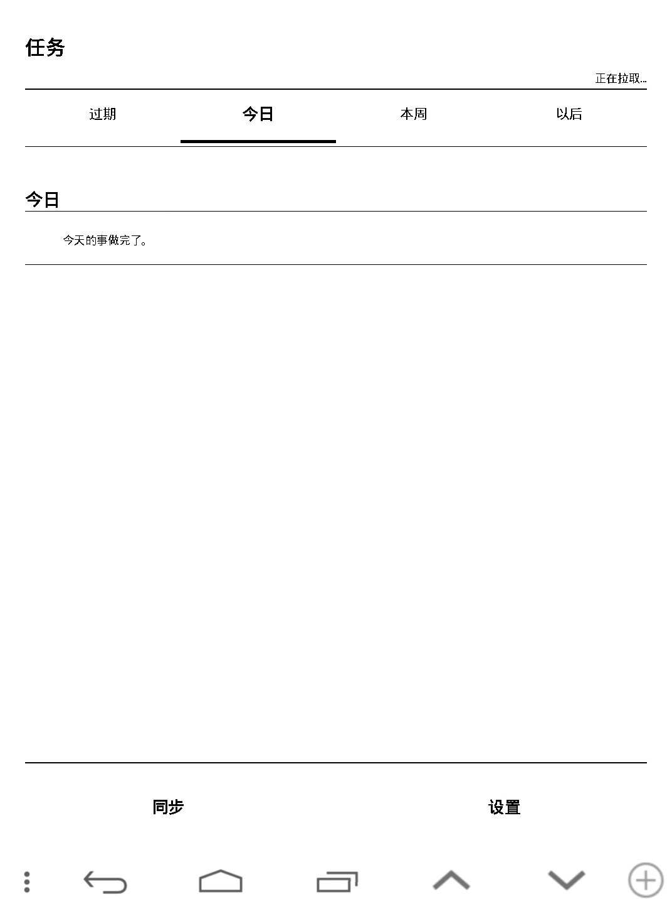
  &nbsp;
  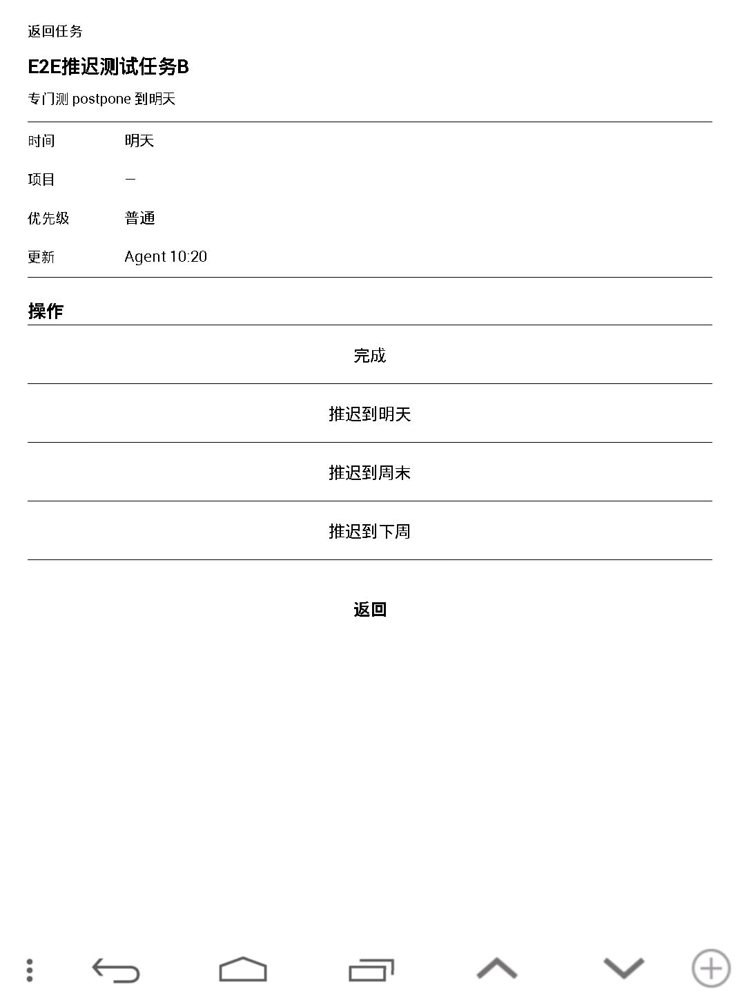
  &nbsp;
  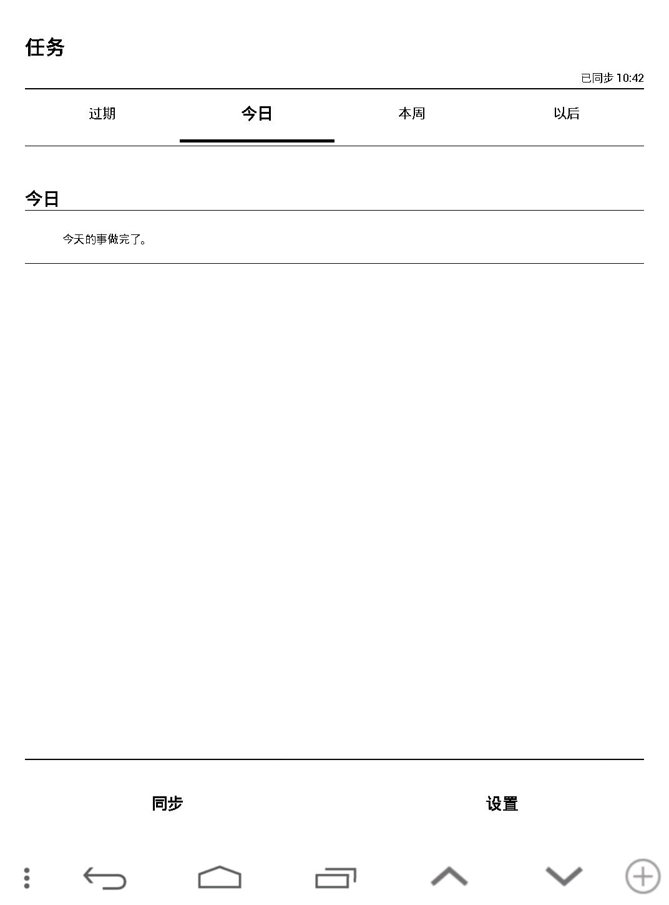
</p>

<p align="center"><sub>Home · Detail · After sync — real captures on Kindle Paperwhite 3 (KOSP)</sub></p>

<p align="center">
  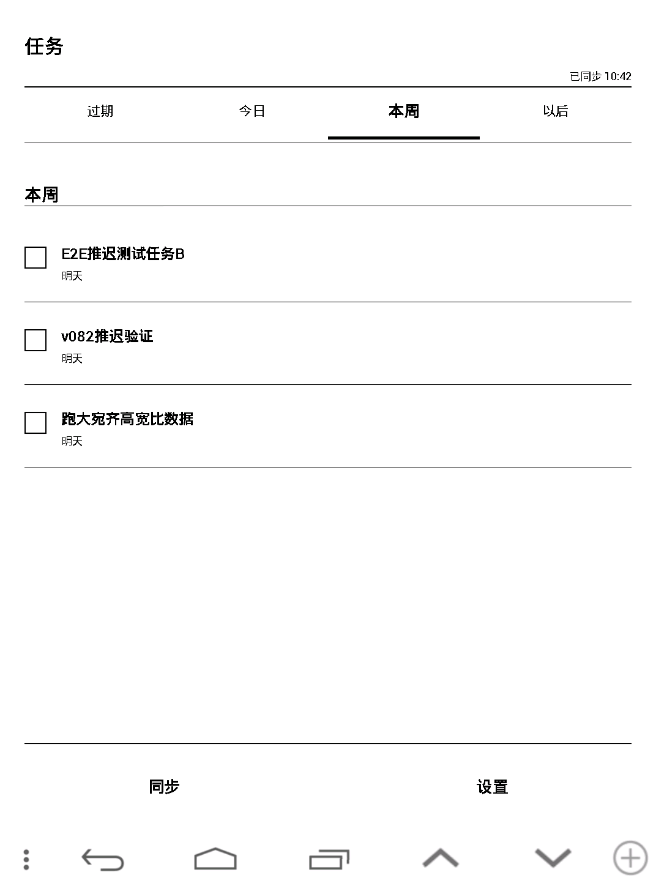
  &nbsp;
  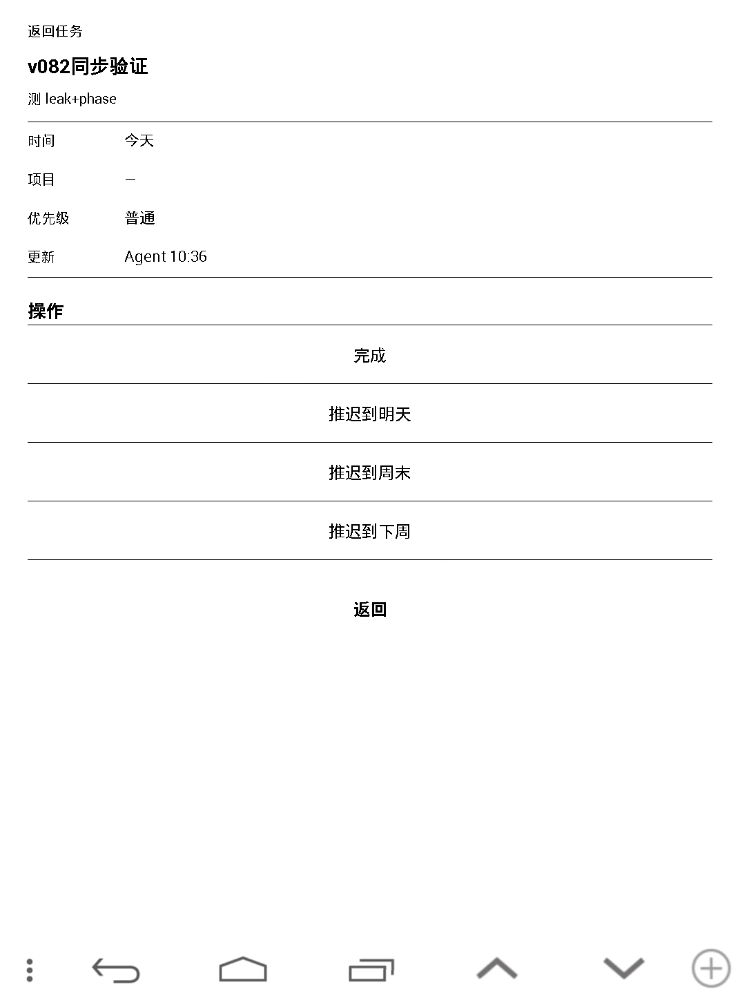
  &nbsp;
  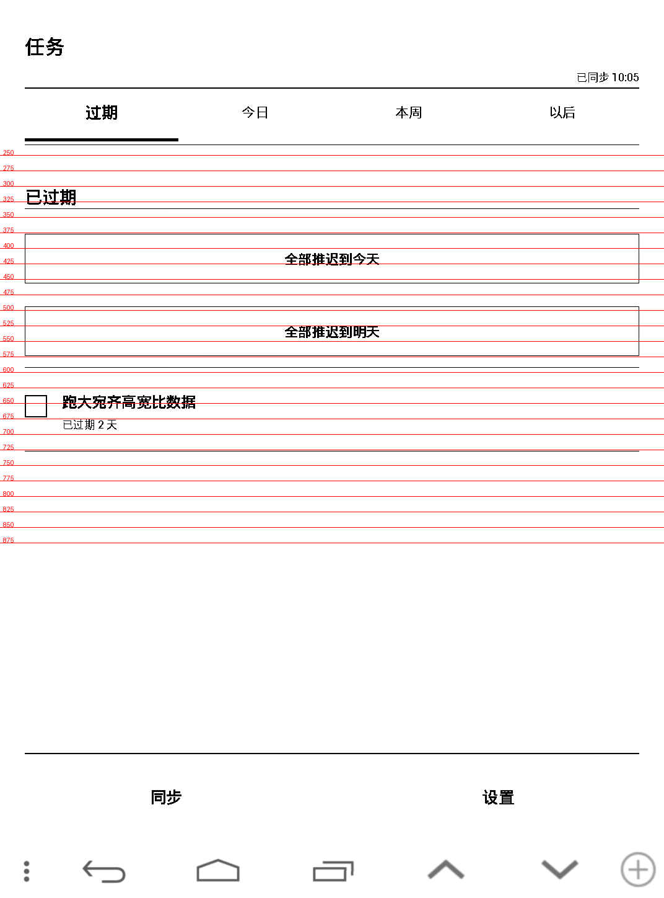
  &nbsp;
  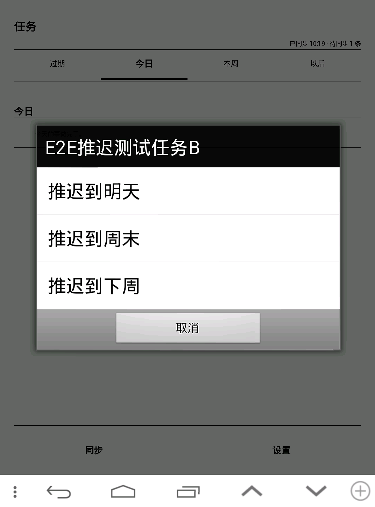
</p>

<p align="center"><sub>Week tab · Action sheet · Annotated e2e · Final state</sub></p>

<p align="center">
  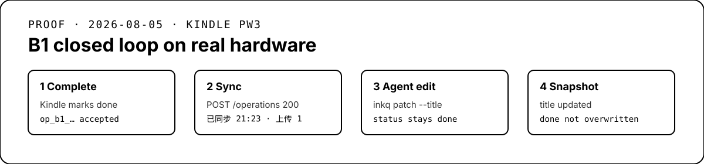
</p>

**B1 closed loop · 2026-08-05 · Kindle PW3** — conflict v2 on real hardware:

> Device owns lifecycle (`status` / `due_*` / `completed_at`). Agent owns text (`title` / `note` / `why`). Completing on device, then patching title from the Agent, must keep `status=done`.

| Step | Evidence |
|---|---|
| Snapshot pull | logcat `GET …/snapshot code=200` · `已同步 21:21` |
| Device complete | local `status=done` + pending `op_b1_1785936229` |
| Upload ops | `POST …/operations ops=1 code=200` · `accepted=1` · `已同步 21:23 · 上传 1 条` |
| Server state | `status=done`, `completed_at=2026-08-05T21:23:52+08:00` (server-stamped) |
| Agent renames | `inkq patch … --title "…-Agent已改title"` |
| Device re-sync | title updated · **`status` still `done`** · `completed_at` preserved |

<details>
<summary><strong>Raw logcat + curl evidence</strong></summary>

```text
# Device logcat (trimmed)
InkQueue SyncClient: GET  …/v1/tasks/snapshot code=200
InkQueue SyncService: performSync success=true msg=已同步 21:21
InkQueue SyncClient: POST …/v1/tasks/operations ops=1 code=200
InkQueue SyncService: ops uploaded accepted=1
InkQueue SyncService: performSync success=true msg=已同步 21:23 · 上传 1 条
```

```bash
# After device complete + Agent title patch — server side
curl -s -H "X-InkQueue-Token: dev-token" \
  "http://127.0.0.1:8787/v1/tasks/snapshot"
# task_msg20zyz_8c7c6d49 →
#   status: done
#   title: B1真机闭环验证任务-Agent已改title
#   completed_at: 2026-08-05T21:23:52+08:00
```

Annotated e2e board: [`docs/screenshots/e2e-05-annotated.png`](docs/screenshots/e2e-05-annotated.png) · full gallery: [`docs/screenshots/`](docs/screenshots/).

</details>

---

## What it is

InkQueue is **not** a general todo app. It is an **execution surface** for tasks an Agent already decided to track.

| Role | Responsibility |
|---|---|
| **Agent** | Create, rewrite, triage, archive via conversation + `inkq` |
| **Server** | Source of truth · apply device ops · stamp timestamps · emit events/webhooks |
| **Kindle** | Cache · offline queue · complete / postpone · large black-on-white UI |

### Why native Java (not Flutter / RN / WebView)

| Constraint | Choice |
|---|---|
| Target | Kindle PW3, API 19, ~512 MB RAM, slow e-ink refresh |
| Language | **Java only** (no Kotlin) |
| UI | `Activity` + Canvas (`InkMainView` / `InkDetailView`); Settings keeps `EditText` |
| HTTP / JSON | `HttpURLConnection` + `org.json` |
| Storage | `SQLiteOpenHelper` + `SharedPreferences` |
| Dependencies | **No AndroidX / AppCompat / Material** |

Result: cold start stays snappy, APK stays ~**55 KB**, contrast stays pure black/white, touch targets stay large.

---

## How it works

<p align="center">
  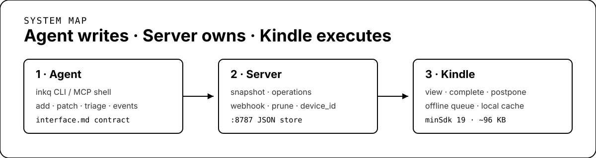
</p>

```text
Agent (inkq / MCP)
        │  POST /v1/tasks  ·  PATCH /v1/tasks/:id  ·  triage
        ▼
   Server :8787          ← JSON store, prune, optional TLS
        │  GET  /v1/tasks/snapshot
        │  POST /v1/tasks/operations   (complete / postpone)
        ▼
Kindle App 「任务」       ← local SQLite + pending_operations
```

**Sync order on device**

1. Paint local cache immediately (never blank-wait on network).
2. Drop dead pending ops (`retry` exhausted / missing type or id).
3. Upload `pending_operations`.
4. Pull snapshot; merge without clobbering in-flight local lifecycle fields.
5. On failure: keep cache, show a short human line — never stack traces.

---

<p align="center">
  
</p>

| Owner | Fields |
|---|---|
| **Device** | `status`, `due_date`, `due_time`, `completed_at` |
| **Agent** | `title`, `note`, `why`, `source_session`, `project`, `priority` |
| **Server** | final `updated_at` / `completed_at` stamps · apply order · prune |

That split is what B1 proved on hardware: Agent text edits never resurrect a completed task.

---

<p align="center">
  
</p>

Five steps · lab defaults (`dev-token`, device `kindle-pw3`, port `8787`).

### 1. Start the server

```bash
node scripts/server-ctl.js start    # or: cd server && npm start
curl http://127.0.0.1:8787/v1/health
# {"ok":true}
```

Default lab token: `dev-token` · header: `X-InkQueue-Token`.

### 2. Talk through the Agent CLI (preferred)

**No skill install required.** Do not hand-roll curl for routine writes.

```bash
node agent/inkq.js health
node agent/inkq.js context
node agent/inkq.js add --title "整理 BootSem 文档" --due tomorrow --time 14:00
node agent/inkq.js list
node agent/inkq.js events --limit 20
node agent/inkq.js triage --today-cap 5          # dry-run
node agent/inkq.js triage --apply --today-cap 5  # apply
```

- Contract: [`agent/interface.md`](agent/interface.md)
- Layers: [`AGENTS.md`](AGENTS.md) · [`docs/architecture.md`](docs/architecture.md)
- API: [`docs/api.md`](docs/api.md)

Optional MCP shell (`mcp-inkqueue`) wraps the same client — only when the host speaks MCP exclusively.

### 3. Build & install the APK

```bash
cd android
./gradlew clean testDebugUnitTest assembleDebug --rerun-tasks
adb install -r app/build/outputs/apk/debug/app-debug.apk
```

APK: `android/app/build/outputs/apk/debug/app-debug.apk` (~55 KB). Desktop label: **任务**.

### 4. Configure the Kindle

Open **设置** (footer, or long-press title):

| Field | Default / example |
|---|---|
| API 地址 | `http://<PC-WLAN-IP>:8787` |
| Token | `dev-token` |
| 设备 ID | `kindle-pw3` |

Kindle and PC must share the same LAN. Android 4.4 has **no `adb reverse`** — real Wi‑Fi only. Optional: Settings → **探测同步地址** (UDP discovery on port `48787`).

Windows firewall (elevated once):

```powershell
netsh advfirewall firewall add rule name="InkQueue TCP 8787" dir=in action=allow protocol=TCP localport=8787
```

### 5. Verify complete / postpone

1. Open **任务** — local cache paints first, then background sync.
2. Tap a row → **任务详情**.
3. **完成** or **推迟到明天 / 周末 / 下周**.
4. UI updates immediately; offline ops show as `待同步 N 条`.
5. Confirm with Agent:

```bash
node agent/inkq.js list
node agent/inkq.js events --limit 10
curl -s -H "X-InkQueue-Token: dev-token" http://127.0.0.1:8787/v1/tasks/snapshot
```

---

## Features (v0.9.5)

Installed on device as `versionName 0.9.5` / `versionCode 95` (startup prune + `dropDeadPendingOperations` + background AlarmManager sync with configurable interval).

**Kindle**

- Tabs: 过期 / 今日 / 本周 / 以后 / **已做**
- Checkbox complete · title → detail · long-press postpone
- Offline queue with visible `待同步 N 条`
- Dead-op cleanup on sync (`dropDeadPendingOperations`)
- Partial list reflow (less full-screen flash)
- LAN UDP discovery + always-on desk mode

**Server**

- Snapshot / operations / create / patch / health
- `/v1/events` + derived `signals` (incl. `chronic_postpone`)
- `/v1/agent/context` for scheduling rhythm
- Outbound webhook envelope `inkqueue.device_event.v1`
- Operations prune: max retain + TTL; **startup auto-prune** (`start()` cleans before serving); response field `pruned`
- `device_id` recorded on applied ops (multi-device audit)
- Optional HTTPS via `INKQUEUE_TLS_KEY` + `INKQUEUE_TLS_CERT`

**Agent**

- `inkq` CLI: health / context / list / get / add / patch / complete / postpone / morning / events / triage
- Chronic hard rules: due-only patch blocked unless `--force`
- Optional `why` / `source_session` audit fields
- Thin MCP adapter (stdio, newline-delimited JSON)

---

## Tests (verified this tree)

```bash
npm test                               # agent triage + server API
cd server && npm test                  # 41/41
node --test agent/test/*.test.js       # 25/25
cd android && ./gradlew testDebugUnitTest
```

| Suite | Result |
|---|---|
| Server API (`server/test`) | **41/41** (startup prune, TTL prune, device_id, events, webhook, conflict paths, If-Modified-Since 304, TLS HTTPS) |
| Agent (`triage` + `client-ops`) | **25/25** (postpone targets, postOperations accepted/ignored/pruned, suggest-split plan + apply) |
| Android JVM (`gradlew testDebugUnitTest`) | **35/35** (DateUtils postpone, SectionedTaskList grouping, SyncResult, JsonUtils, SyncScheduler interval snap) |
| Real device B1 | PW3 complete → Agent title patch → snapshot keeps `done` |

---

## Layout

```text
InkQueue/
  AGENTS.md                 # one-page agent entry
  agent/                    # CLI + contract (+ optional MCP)
  android/                  # minSdk 19 native Java client
  server/                   # Node reference API + tests
  docs/                     # product-spec · api · architecture · screenshots
  assets/readme/            # hero / architecture / section / B1 SVGs
  scripts/server-ctl.js
```

---

## Hardening notes (v0.9.5)

| Topic | Behavior |
|---|---|
| Dead pending (device) | Drop ops with empty type/task_id or `retry_count` ≥ max |
| Dead ops (server) | Drop typeless legacy rows; TTL default 30d; max retain 500; **startup prune** cleans before serving |
| Multi-device | Same token; each applied op stores `device_id` for audit |
| Background sync (device) | AlarmManager `ELAPSED_REALTIME_WAKEUP` + inexact repeating; interval selectable in Settings (1/5/15/30 min or 关闭); `SyncTickReceiver` holds a partial wake-lock ≤20s per tick to keep sync alive on e-ink suspend; rescheduled on app launch |
| Server power-save | `GET /v1/tasks/snapshot` honors `If-Modified-Since` → **304** with empty body when store unchanged; client polls cheaply every few minutes without downloading JSON |
| TLS | Set both `INKQUEUE_TLS_KEY` and `INKQUEUE_TLS_CERT` to serve HTTPS directly; reverse proxy (Caddy / nginx) still preferred in production; Kindle 4.4 self-signed CA import steps in [`docs/api.md`](docs/api.md) |
| HTTP cleartext | Allowed for LAN lab only |

Env knobs: `INKQUEUE_MAX_OPERATIONS`, `INKQUEUE_OPERATIONS_TTL_DAYS`, `INKQUEUE_TOKEN`, `INKQUEUE_TOKEN_PREV`, `INKQUEUE_PORT`.

---

## Known limitations

- Pull-only sync (open app / tap 同步) — no push notifications
- Single shared token — not multi-user auth
- Reference store is a JSON file (swap D1/KV/DB later)
- Agent does **not** scrape chat history; it must call `inkq` on purpose
- KOSP Wi‑Fi / ADB can be fragile; do not remote-toggle Wi‑Fi via `svc wifi`
- Partial refresh is best-effort on stock 4.4 (no vendor e-ink API)
- Some APs block UDP discovery broadcast

---

## Roadmap

**Shipped**

- v0.1–v0.8.2: native client, Canvas UI, offline queue, Settings design pass, ~55 KB APK
- v0.9.0: partial reflow, 已做 tab, chronic signals, LAN discovery, Windows logon install
- v0.9.1: conflict v2, `why`/`source_session`, triage, webhook envelope, MCP triage tool
- v0.9.2: dead-op prune both sides, `device_id` audit, optional TLS, B1 closed-loop docs, README redesign, device reinstall verified (`versionCode 92`)
- **v0.9.3**: token rotate (`TOKEN_PREV`), store `.bak` rotate/heal, `events --device`, `ignored_details`, CLI complete/postpone/morning, e-ink UX harden (long-press cancel, empty-state copy), (`versionCode 93`)
- **v0.9.4**: startup auto-prune (server cleans before serving), Android parses `pruned` + masthead 「服务端清理 N 条」, TTL/startup prune tests, postOperations end-to-end test, (`versionCode 94`)
- **v0.9.5**: triage `--suggest-split` (chronic 首选拆分执行而非整块推迟) + `--split-parts N` + 6 plan/apply 单测, Kindle 后台同步 (AlarmManager ELAPSED_REALTIME_WAKEUP + inexact repeating + SyncTickReceiver partial wake-lock ≤20s, Settings 后台同步 interval 1/5/15/30 min / 关闭), server `If-Modified-Since` 304 省电 + Last-Modified 头 + writeStore mtime bump to next whole second, TLS HTTPS 端到端真跑验通 (自签证书 + `INKQUEUE_TLS_KEY/CERT` 直接 HTTPS + Caddy 反代 + Kindle 4.4 自签 CA 导入文档), (`versionCode 95`)

**Not in scope (separate products)**

- Daily briefing / RSS / career radar / WeChat Reading sidecar

**Later candidates**

- Vendor e-ink partial API if KOSP exposes one
- Stronger production store (SQLite/D1) behind the same HTTP contract
- `inkq triage` `--force-chronic` for explicit "整块推迟" keep-as-one deferral
- Agent-facing webhook reverse-notify (server → Agent on device events) via background sync ticks rather than FCM/Push
- TLS reverse-proxy production hardening proven run

---

## License

MIT. See [LICENSE](LICENSE).
